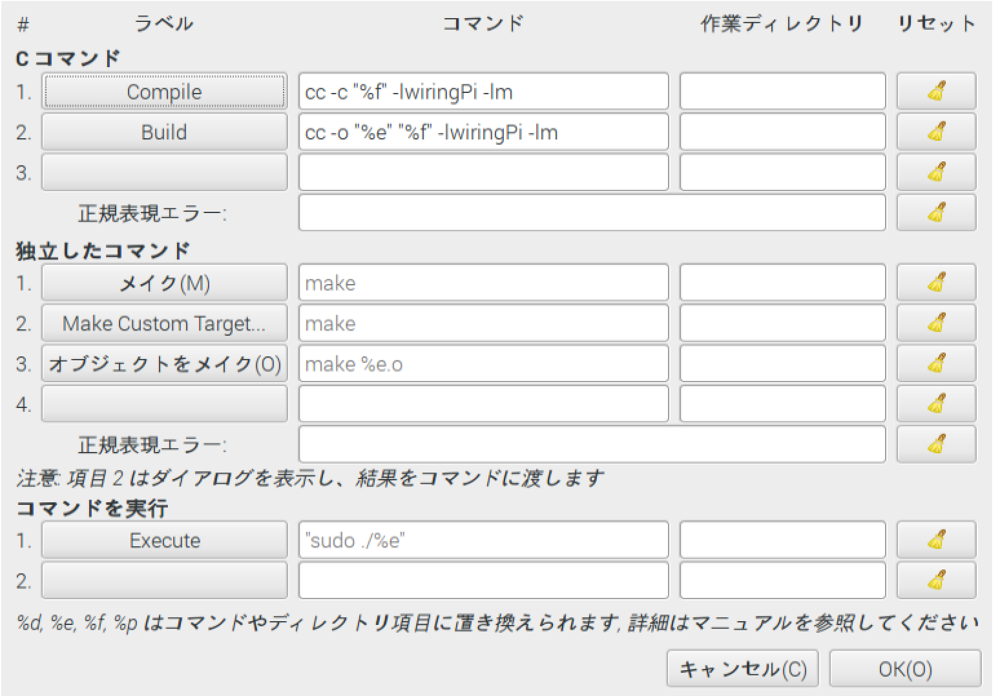

# Raspberry-Pi-Setup

vi /etc/apt/sources.list 
append 3 lines 
deb http://ftp.jp.debian.org/debian/ squeeze main non-free contrib 
deb http://security.debian.org/ squeeze/updates main contrib non-free 
deb http://ftp.jp.debian.org/debian/ squeeze-updates main contrib non-free 
 
apt-get update 
apt-get upgrade 
rpi-update 
 
raspi-config 
 
 
apt-get install numlockx 
apt-get install gparted 
apt-get install libreoffice-l10n-ja libreoffice-help-ja 
apt-get install iceweasel iceweasel-l10n-ja 
apt-get install pishutdown 
apt-get install midori 
apt-get install geany geany-plugins 
apt-get install jstest-gtk 
apt-get install ibus-anthy 
apt-get install fonts-takao xfonts-kaname ttf-kochi-gothic xfonts-intl-japanese 
apt-get install jfbterm 
apt-get install ksnapshot 
 
vi /boot/config.txt 
cut '#' disable_overscan=1 
append 'dtparam=act_led_trigger=heartbeat' 
append 'max_usb_current=1' 
 
apt-cache search 'file name' 
 
(CPU Temp)vcgencmd measure_temp 
 
(Geany setting) 

